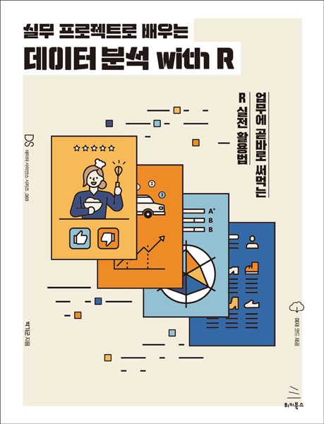

# 실무 프로젝트로 배우는 데이터 분석 with R
### 업무에 곧바로 써먹는 R 실전 활용법

- **박기군** 지음
- ISBN: 9791158392567
- 판형: 175*235*23mm
- 28,000원 | 2021년 5월 13일 발행 | 448쪽
- [책 홈페이지](https://wikibook.co.kr/practical-r/)
- [도서 미리보기](http://www.yes24.com/Product/Viewer/Preview/101441297)
- [도서 관련 문의](https://wikibook.co.kr/support/contact/)

---

**데이터 분석 프로젝트를 수행할 때 필요한 핵심 역량이 궁금하다면?**

4차 산업혁명이 도래한 이후 많은 사람들이 데이터 분석을 공부하고 있습니다. 하지만 실제로 분석 프로젝트에 투입되어 업무를 수행할 때는 이론과 현실의 차이에서 발생하는 문제 때문에 많은 분들이 어려움을 겪고 있습니다. 이 책은 실제 분석 프로젝트를 수행할 때 발생할 수 있는 문제와 이를 해결하는 데 필요한 내용을 다룹니다.

**★ 이 책에서 다루는 내용 ★**

- 데이터 분석 과정의 이해
- R을 활용한 데이터 전처리 기술과 시각화 기법
- 데이터 분석에 필요한 통계 및 기계학습 기초 이론
- 예측을 위한 예측 모형 구성 
- 마케팅을 위한 RFM 분석
- 감성분석을 위한 텍스트 분석
- 고객 취향분석을 위한 연관 분석 및 추천시스템 분석

---
 
 ## 구입처
 
 - [예스24](http://www.yes24.com/Product/Goods/101441297)
 - [교보문고](http://www.kyobobook.co.kr/product/detailViewKor.laf?barcode=9791158392567)
 - [인터파크](http://book.interpark.com/product/BookDisplay.do?_method=detail&sc.prdNo=349457350)
 - [알라딘](https://www.aladin.co.kr/shop/wproduct.aspx?ItemId=270621371)

---

## 각 장별 데이터 소스

- 2장
    - [중고차 데이터](https://www.kaggle.com/adityadesai13/used-car-dataset-ford-and-mercedes)
- 6장
    - [eCommerce Events History in Cosmetic Shop](https://www.kaggle.com/mkechinov/ecommerce-events-history-in-cosmeticsshop)
- 7장
    - [E-Commerce Reviews for Women
Clothings](https://www.kaggle.com/datasets/nicapotato/womens-ecommerce-clothing-reviews)
- 8장
    - [Instacart Market Basket Analysis](https://www.kaggle.com/psparks/instacart-market-basket-analysis)
